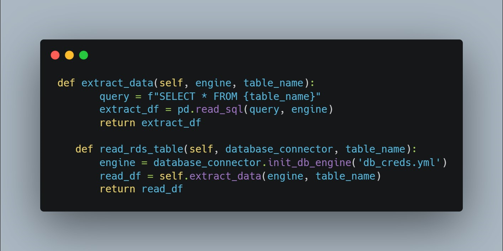
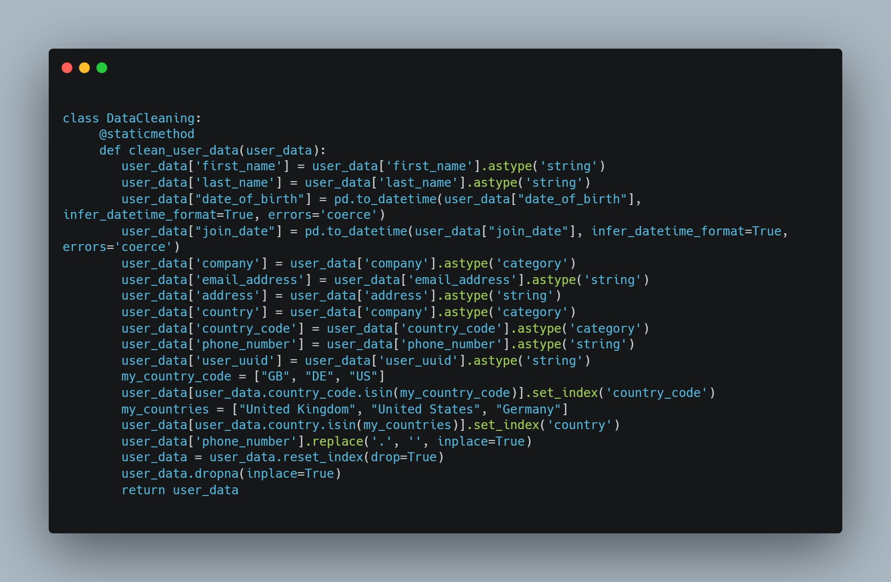

# Multinational Retail Data Centralisation

# Table of Contents
1. [Introduction](#introduction)
2. [#Setting up the environment](#Setting-up-the-environment)
3. [Extracting and cleaning the data from the data sources](#Extracting-and-cleaning-the-data-from-the-data-sources)
    - [Setting up a new database to store the data](#Setting-up-a-new-database-to-store-the-data)
    - [Initializing the three project classes](#Initializing-the-three-project-classes)
    - [Extracting and cleaning the user data](#Extracting-and-cleaning-the-user-data)
    - [Extracting users and cleaning card details](#Extracting-users-and-cleaning-card-details)
    - [Extracting and cleaning the details of each store](#Extracting-and-cleaning-the-details-of-each-store)
    - [Extracting and cleaning the product details](#Extracting-and-cleaning-the-product-details)
    - [Retrieving and cleaning the orders table](#Retrieving-and-cleaning-the-orders-table)
    - [Retrieving and cleaning the events data](#Retrieving-and-cleaning-the-events-data)
4. [Creating the database schema](#Creating-the-database-schema)
5. [Querying the data](#Querying-the-data)
7. [Installation Instructions](#Installation-Instructions)
8. [Usage Instructions](#Usage-Instructions)
9. [License Information](#License-Information)
    
## Introduction

This project was built to help me develop the skilsl to extract and clean data from data sources, creating a database schema and quering data.
In this project, I work for a multinational company that sells various goods across the globe.Currently, their sales data is spread across many different data sources making it not easily accessible or analysable by current members of the team.
In an effort to become more data-driven, my organisation would like to make its sales data accessible from one centralised location. My first goal will be to produce a system that stores the current company data in a database so that it's accessed from one centralised location and acts as a single source of truth for sales data. I will then query the database to get up-to-date metrics for the business. 

## Setting up the environment

In this project, I use GitHub to track changes to my code and save them online in a GitHub repo. 

## Extracting and cleaning the data from the data sources

### Setting up a new database to store the data

In this step, I initialise a new database locally to store the extracted data.I then Set up a new database within pgadmin4 and name it sales_data.
This database will store all the company information once I extract it for the various data sources.

### Initialising the three project classes

In this task I was defining the scripts and Classes I will use to extract and clean the data from multiple data sources.

I created a new Python script named data_extraction.py and within it, created a class named DataExtractor. This class will work as a utility class, in it I will be creating methods that help extract data from different data sources. The methods contained will be fit to extract data from a particular data source, these sources will include CSV files, an API and an S3 bucket.

I then created another script named database_utils.py and within it, created a class DatabaseConnector which I will use to connect with and upload data to the database.

Finally, I created a script named data_cleaning.py this script will contain a class DataCleaning with methods to clean data from each of the data sources.

### Extracting and cleaning the user data

The historical data of users is currently stored in an AWS database in the cloud.
I created methods in my DataExtractor and DatabaseConnector class which help extract the information from an AWS RDS database.

### Extracting users and cleaning card details
The users card details are stored in a PDF document in an AWS S3 bucket.
I installed the Python package tabula-py to extract data from a pdf document. I then
created a method in your DataExtractor class called retrieve_pdf_data, which takes in a link as an argument and returns a pandas DataFrame. I could then extract all pages from the pdf document and return a DataFrame of the extracted data. Next I created a method called clean_card_data in my DataCleaning class to clean the data to remove any erroneous values, NULL values or errors with formatting.
Once cleaned, I could upload the table with my upload_to_db method to the database in a table called dim_card_details.

### Extracting and cleaning the details of each store
I retreived the store data using an API which had two GET methods. One returned the number of stores in the business and the other retreive the store given a store number. I included the API key to connect to the API. I created a dictionary to store the header details and had two endpoints for the API. 

I created a method in my DataExtractor class called list_number_of_stores which returns the number of stores to extract. This told me how many stores needed to be extracted from the API. I created another method retrieve_stores_data which retrieved a store endpoint as an argument and extracted all the stores from the API saving them in a pandas DataFrame. I created a method in the DataCleaning class called_clean_store_data which cleaned the data retrieve from the API and returned a pandas DataFrame. Finally I could upload my DataFrame to the database using the upload_to_db method storing it in the table dim_store_details.

### Extracting and cleaning the product details
The information for each product the company currently sells is stored in CSV format in an S3 bucket on AWS. I created a method in DataExtractor called extract_from_s3 which used the boto3 package to download and extract the information returning a pandas DataFrame. I logged into the AWS CLI to retreive the data from the bucket.
I created a method in the DataCleaning class called convert_product_weights which took the products DataFrame as an argument and returned the products DataFrame. I ensured all of the weights in the data frame had the same units by converting them to decimal values. I used a 1:1 ratio of ml to g as a rough estimate for the rows containing ml.
I developed the method to clean up the weight column and remove all excess characters then represent the weights as a float.I created another method called clean_products_data to clean the DataFrame of any additional erroneous values.I could then insert the data into the sales_data database using my upload_to_db method storing it in a table named dim_products.

### Retrieving and cleaning the orders table
This table acted as the single source of truth for all orders the company has made in the past is stored in a database on AWS RDS. I listed all the tables in the database to get the name of the table containing all information about the product orders.
I could then extract the orders data using the read_rds_table method returning a pandas DataFrame. I created a method in DataCleaning called clean_orders_data which cleaned the orders table data.
This table is what was at the center of my star based database schema.
Once cleaned I could  upload using the upload_to_db method and store in a table called orders_table.

### Retrieving and cleaning the events data
Here, I extracted a JSON file which had the details of when each sale happened as well as related attributes. I uploaded this data to the database and named it dim_date_times.

## Creating the database schema

In this task I developed the star-based schema of my database, ensuring that the colummns were of the correct datatypes. This included casting the columns of the dim_users_table to the correct data types and updating the dim_store_details table.

## Querying the database schema

Finally, I was task with answering business questions and extracting the data from the database using SQL. I answered questions such as: Which locations currently have the most stores? and How many sales are coming from online?

## Installation instructions

To carry out this project, you will need to have an AWS account, and VSCode installed on your machine. You will also need PgAdmin installed.

## License information

